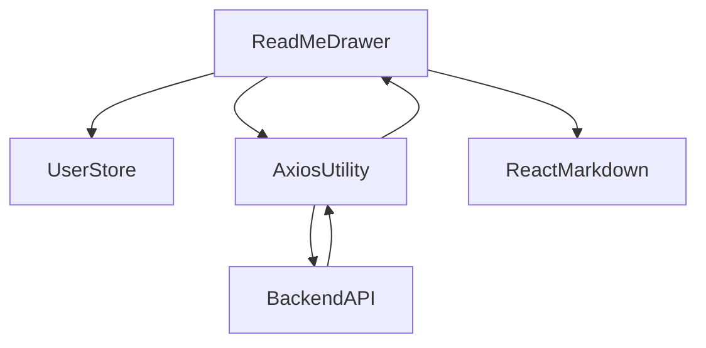

# grms-frontend/src/components/Drawers/ReadMeDrawer.tsx

> **Source File:** [grms-frontend/src/components/Drawers/ReadMeDrawer.tsx](https://github.com/test-company-prowiz/Easy-Repo/blob/master/grms-frontend/src/components/Drawers/ReadMeDrawer.tsx)
> **Repository:** `Easy-Repo`
> **Branch:** `master`

# grms-frontend/src/components/Drawers/ReadMeDrawer.tsx

### Overview
This file defines the `ReadMeDrawer` React component, which is responsible for displaying the README content of a specified repository within a slide-out drawer. It fetches the README content from a backend API and renders it as Markdown.

### Architecture & Role
This component resides in the `grms-frontend` application's presentation layer, specifically within the `components/Drawers` directory. It acts as a UI element that conditionally renders based on global application state, fetching and displaying dynamic content.

### Key Components
*   **`ReadMeDrawer`**: The main functional React component that orchestrates the data fetching and rendering of the README content.
*   **`useUserStore`**: A Zustand store hook used to manage global UI state, specifically the `readMeDrawerOpen` boolean for drawer visibility and `repoName` to identify which repository's README to fetch.
*   **`useAxios`**: A custom hook for handling API requests, providing state for `response`, `setResponse`, and `fetchData`.
*   **`Drawer`, `DrawerContent`, `DrawerHeader`, `DrawerBody`**: Components from `@nextui-org/react` used to construct the drawer UI.
*   **`ReactMarkdown`**: A library used to parse and render Markdown content fetched from the API into HTML.

### Execution Flow / Behavior
1.  The `ReadMeDrawer` component renders, initially closed if `readMeDrawerOpen` from `useUserStore` is `false`.
2.  Upon initial render or when the `repoName` from `useUserStore` changes, an `useEffect` hook triggers `fetchData`.
3.  `fetchData` from `useAxios` makes a GET request to `/easyrepo/insights/repo/getReadMe/{repoName}` to retrieve the README content.
4.  The fetched data is stored in the `response` state of `useAxios`.
5.  The `response?.data` (expected to be Markdown text) is passed to `ReactMarkdown` for rendering inside the `DrawerBody`.
6.  The `handleOpenChange` callback is invoked when the drawer's open state changes. If the drawer closes (`isOpen` is `false`), it updates `readMeDrawerOpen` in `useUserStore` to `false` and clears the `response` data.

### Dependencies
*   **`react`**: Core library for building UI components.
*   **`@nextui-org/react`**: Provides UI components, specifically the `Drawer` component for the overlay.
*   **`../../store/UserStore`**: Internal dependency for managing global user-related state, including drawer visibility and selected repository name.
*   **`../../utility/axiosUtils`**: Internal utility hook for abstracting API call logic.
*   **`react-markdown`**: External library for rendering Markdown strings.

### Design Notes
The component utilizes a global state management solution (`useUserStore`) to control its visibility and provide the context (`repoName`) for data fetching. This allows other parts of the application to open and close the drawer without direct prop drilling. The `useAxios` hook encapsulates the API interaction, promoting reusability and separation of concerns. The use of `ReactMarkdown` directly renders raw Markdown content received from the backend, reducing frontend parsing complexity. The `handleOpenChange` function ensures that when the drawer is closed, its state is reset, preventing stale data from being displayed on subsequent openings if the `repoName` hasn't changed.

### Diagram
