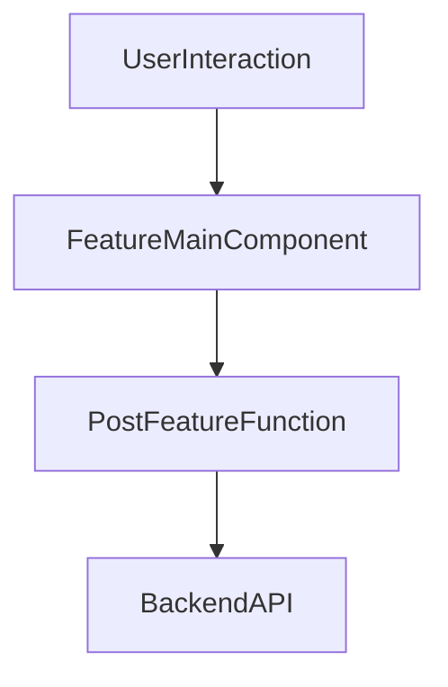

# grms-frontend/src/components/FeatureComponents/FeatureMain.tsx

> **Source File:** [grms-frontend/src/components/FeatureComponents/FeatureMain.tsx](https://github.com/test-company-prowiz/Easy-Repo/blob/master/grms-frontend/src/components/FeatureComponents/FeatureMain.tsx)
> **Repository:** `Easy-Repo`
> **Branch:** `master`

# grms-frontend/src/components/FeatureComponents/FeatureMain.tsx

### Overview
This file defines the `FeatureMain` React functional component, which provides a user interface for submitting feature requests to a backend service. It includes an input field for the feature description, a submission button, and displays information about project contributors.

### Architecture & Role
This file resides in the `src/components/FeatureComponents` directory, indicating its role as a presentational component within the frontend's feature-related UI. It acts as a leaf component that encapsulates specific user interaction and data submission logic, directly interacting with the backend API.

### Key Components
*   **`FeatureMain`**: The default exported functional React component responsible for rendering the feature request interface and handling its state and interactions.
*   **`value` (state)**: A React state variable that stores the current input text for the feature description.
*   **`backendUrl`**: An environment variable (`VITE_BACKEND_URL`) providing the base URL for backend API calls.
*   **`postFeature`**: An asynchronous function that handles the submission of the feature request. It sends a POST request to the backend API.

### Execution Flow / Behavior
1.  The `FeatureMain` component renders a `Textarea` for user input, a "Request" `Button`, a `Chip` displaying a message, and `User` components for contributors.
2.  As a user types into the `Textarea`, the `value` state is updated, and the input is displayed dynamically.
3.  When the "Request" `Button` is pressed, the `postFeature` function is invoked.
4.  `postFeature` checks if the `value` length is greater than 10 characters.
5.  If the condition is met, it initiates an `axios.post` request to the configured `backendUrl` at the `/easyrepo/post/feature` endpoint.
6.  The request body includes the `description` (the `value` from the `Textarea`) and carries credentials (`withCredentials: true`) along with a CSRF token retrieved from `sessionStorage` in the `X-CSRF-TOKEN` header.
7.  The component also statically displays contributor information using NextUI's `User` component.

### Dependencies
*   **`@nextui-org/react`**: Provides UI components such as `Textarea`, `Button`, `Chip`, `User`, and `Code` for building the user interface.
*   **`react`**: The core React library for building UI components and managing state.
*   **`axios`**: A promise-based HTTP client used for making API requests to the backend.
*   **`import.meta.env.VITE_BACKEND_URL`**: An environment variable used to configure the backend API endpoint.
*   **`sessionStorage`**: Used to retrieve the CSRF token for authenticated API requests.

### Design Notes
*   **UI Framework**: Leverages NextUI for a consistent and modern look and feel.
*   **CSRF Protection**: Implements client-side CSRF token handling by retrieving it from `sessionStorage` and including it in the request headers.
*   **Client-Side Validation**: Includes a basic length check (`value.length > 10`) before submitting the feature request, preventing overly short submissions.
*   **Direct API Interaction**: The component directly handles API calls. For larger applications, this logic might be abstracted into a dedicated service or data fetching layer to separate concerns.
*   **Hardcoded Contributor Data**: The contributor information is currently hardcoded within the component. In a dynamic system, this data would typically be fetched from an API.

### Diagram
