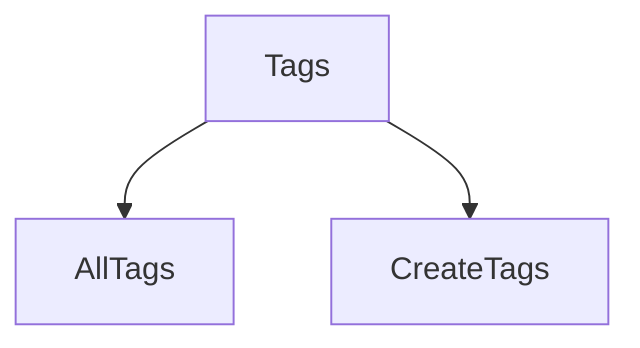

# grms-frontend/src/components/TagComponents/Tags.tsx

> **Source File:** [grms-frontend/src/components/TagComponents/Tags.tsx](https://github.com/test-company-prowiz/Easy-Repo/blob/master/grms-frontend/src/components/TagComponents/Tags.tsx)
> **Repository:** `Easy-Repo`
> **Branch:** `master`

# grms-frontend/src/components/TagComponents/Tags.tsx

### Overview
This file defines the `Tags` React functional component, which serves as an aggregation point for other tag-related UI components. Its primary purpose is to combine the display of all existing tags and the functionality to create new tags into a single view.

### Architecture & Role
This file resides in the frontend's component layer, specifically within the `TagComponents` module. It acts as a composite UI component, orchestrating the rendering of its child components (`AllTags` and `CreateTags`) to present a consolidated tag management interface.

### Key Components
-   **`Tags` functional component**: The default export of this file. It renders the `AllTags` and `CreateTags` components within a `div` element.

### Execution Flow / Behavior
When the `Tags` component is rendered by a parent component, it subsequently renders its two child components: `AllTags` and `CreateTags`. Both child components are rendered concurrently within the same `div` container, presenting their respective UIs (displaying tags and a tag creation form) side-by-side.

### Dependencies
-   `./AllTags`: An internal dependency, imported and rendered by `Tags` to display existing tags.
-   `./CreateTags`: An internal dependency, imported and rendered by `Tags` to provide functionality for creating new tags.

### Design Notes
This component follows a composition pattern, consolidating related UI elements into a single, higher-level component. This simplifies the parent component's responsibility by abstracting the details of individual tag management features. A potential design consideration for future enhancements could involve introducing shared state or context if `AllTags` and `CreateTags` need to directly interact or share data (e.g., `CreateTags` invalidates a cache for `AllTags` after creation).

### Diagram
