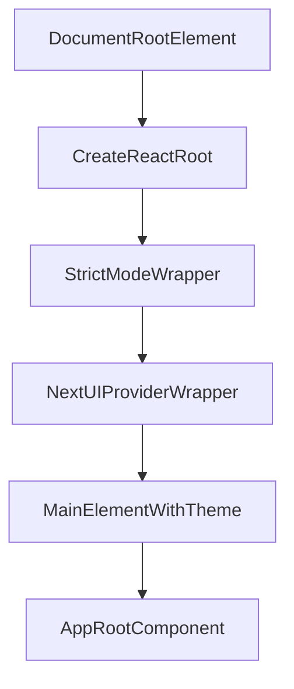

# grms-frontend/src/main.tsx

> **Source File:** [grms-frontend/src/main.tsx](https://github.com/test-company-prowiz/Easy-Repo/blob/master/grms-frontend/src/main.tsx)
> **Repository:** `Easy-Repo`
> **Branch:** `master`

# grms-frontend/src/main.tsx

### Overview
This file serves as the primary entry point for the client-side React application. It is responsible for initializing the React rendering engine and mounting the root application component into the DOM.

### Architecture & Role
Architecturally, this file acts as the application's bootstrapping layer within the frontend client. It resides at the presentation layer, specifically handling the initial rendering and setup of the React component tree within the browser environment.

### Key Components
-   **`createRoot` (from `react-dom/client`)**: Initializes a React root for concurrent mode rendering.
-   **`StrictMode` (from `react`)**: A wrapper component that activates additional checks and warnings for its descendants during development.
-   **`NextUIProvider` (from `@nextui-org/react`)**: Provides context for NextUI components, enabling them to access theme, motion, and other UI-related configurations.
-   **`App` (from `./App.tsx`)**: The root component of the application, encapsulating the main application logic and UI.

### Execution Flow / Behavior
Upon execution in the browser, the script performs the following actions:
1.  It identifies the DOM element with the ID `root`.
2.  A React root is created using `createRoot` for this DOM element.
3.  The main application component (`App`) is rendered within a `StrictMode` wrapper.
4.  The `App` component is further nested inside a `NextUIProvider` to ensure NextUI components function correctly and share theme context.
5.  A `main` HTML element with `dark text-foreground bg-background` classes is used to apply a global dark theme and background.
6.  This entire component tree is then rendered into the previously identified `root` DOM element, initiating the React application.

### Dependencies
-   **`react`**: Core React library for UI component definition.
-   **`react-dom/client`**: Provides client-specific DOM rendering capabilities for React.
-   **`@nextui-org/react`**: External UI component library providing the `NextUIProvider` for theme and component context.
-   **`./index.css`**: Global CSS styles applied across the application.
-   **`./App.tsx`**: The main application component, representing the entire UI structure.

### Design Notes
The use of `StrictMode` is a development-time best practice, helping to identify potential issues and deprecated lifecycles. Wrapping the entire application in `NextUIProvider` centralizes UI theme management. The explicit `main` element with `dark text-foreground bg-background` classes sets up the global dark mode styling at the root of the application, which is a common pattern for theme application.

### Diagram
