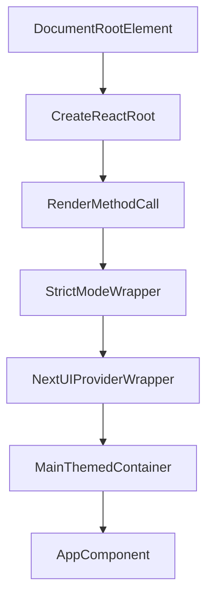

# grms-frontend/src/main.tsx

> **Source File:** [grms-frontend/src/main.tsx](https://github.com/test-company-prowiz/Easy-Repo/blob/master/grms-frontend/src/main.tsx)
> **Repository:** `Easy-Repo`
> **Branch:** `master`

# grms-frontend/src/main.tsx

### Overview
This file serves as the primary entry point for the client-side React application. It is responsible for initializing the React root and rendering the main application component (`App.tsx`) into the DOM.

### Architecture & Role
Architecturally, `main.tsx` functions as the top-level bootstrap for the frontend application. It resides in the presentation layer and acts as the initial render mechanism, mounting the entire React component tree onto the specified HTML DOM element.

### Key Components
*   **`StrictMode`**: A React component that activates additional checks and warnings during development, helping to identify potential issues.
*   **`createRoot`**: A function from `react-dom/client` used to create a React root for managing concurrent updates to the DOM.
*   **`NextUIProvider`**: A context provider from `@nextui-org/react` that supplies theming, styling, and configuration to all NextUI components within the application.
*   **`App`**: The root component of the application, defined in `App.tsx`, which contains the primary application structure and UI.

### Execution Flow / Behavior
The file first locates the DOM element with the ID `root`. It then uses `createRoot` to establish a React root on this element. Subsequently, the `render` method is called to mount the application's component tree. This tree includes `StrictMode`, which wraps `NextUIProvider`, ensuring all child components receive NextUI context. Inside `NextUIProvider`, a `main` HTML element is rendered with specific CSS classes (`dark text-foreground bg-background`) to set initial styling, and finally, the `App` component is rendered within this `main` container.

### Dependencies
*   **`react`**: Core React library for components and hooks.
*   **`react-dom/client`**: Client-specific React DOM APIs for browser rendering.
*   **`@nextui-org/react`**: Provides the NextUI component library and its context provider.
*   **`./index.css`**: Global stylesheet for base application styling.
*   **`./App.tsx`**: The main application component that defines the application's user interface.

### Design Notes
The use of `StrictMode` indicates a focus on robust development practices, aiming to catch common issues early. Integrating `NextUIProvider` at the root ensures consistent theming and component behavior across the entire application. The explicit `main` element with `dark text-foreground bg-background` classes suggests an immediate dark mode application, leveraging NextUI's styling capabilities from the entry point.

### Diagram 
