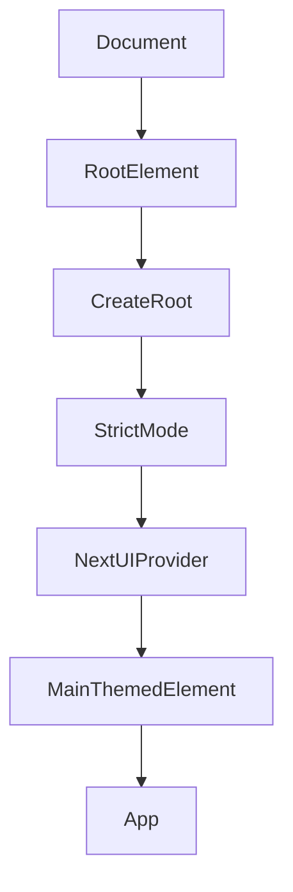

# grms-frontend/src/main.tsx

> **Source File:** [grms-frontend/src/main.tsx](https://github.com/test-company-prowiz/Easy-Repo/blob/master/grms-frontend/src/main.tsx)
> **Repository:** `Easy-Repo`
> **Branch:** `master`

# grms-frontend/src/main.tsx

### Overview
This file serves as the main entry point for the client-side React application, responsible for initializing the rendering process and setting up global UI providers.

### Architecture & Role
Architecturally, this file functions as the root of the user interface layer. It bootstraps the entire React application by rendering the primary `App` component into the Document Object Model (DOM) and integrates essential global contexts, such as the UI component library's theme provider.

### Key Components
-   `createRoot`: A function from `react-dom/client` used to establish a React root for concurrent rendering.
-   `StrictMode`: A React wrapper component that activates additional development-time checks and warnings for its descendant components.
-   `NextUIProvider`: A context provider from the `@nextui-org/react` library, essential for NextUI components to function correctly and to apply global UI configurations, including theming.
-   `App`: The main application component that encapsulates the entire user interface structure and logic.

### Execution Flow / Behavior
Upon execution, the file imports all necessary modules. It then locates the HTML element with the ID `root` in the `document`. The `createRoot` function is invoked to render the main React component tree into this identified DOM element. The `App` component is nested within `StrictMode` for development diagnostics and within `NextUIProvider` to apply NextUI styling and theme context. A `main` HTML element wraps the `App` component, explicitly applying the `dark` theme and setting `text-foreground` and `bg-background` classes, indicating theme-dependent text and background colors.

### Dependencies
-   `react`: Provides core React functionalities, including the `StrictMode` component.
-   `react-dom/client`: Offers client-specific utilities for DOM rendering, specifically `createRoot` for React 18+.
-   `@nextui-org/react`: An external UI component library that supplies `NextUIProvider` for global theme management and component integration.
-   `./index.css`: A local stylesheet containing global CSS rules applied across the application.
-   `./App.tsx`: The principal application component, defining the high-level layout and functionality.

### Design Notes
-   The use of `StrictMode` is a development-specific feature that aids in identifying potential issues, having no impact on production performance.
-   `NextUIProvider` centrally manages the UI theme, with the `dark` class explicitly applied to the `main` element to enforce a dark mode aesthetic across the application.
-   Leveraging React 18's `createRoot` enables concurrent rendering features, potentially improving perceived performance.

### Diagram
