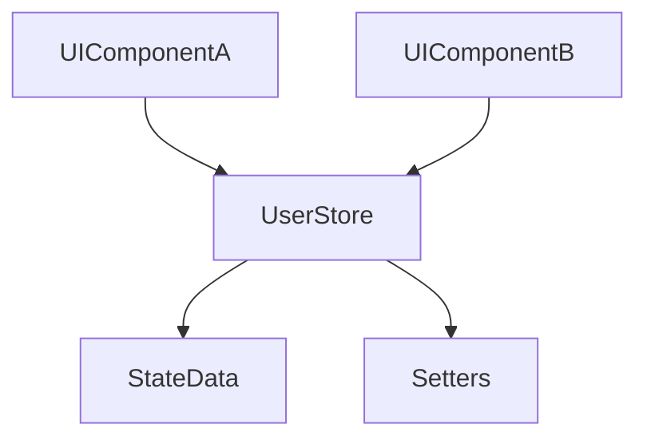

# grms-frontend/src/store/UserStore.tsx

> **Source File:** [grms-frontend/src/store/UserStore.tsx](https://github.com/test-company-prowiz/Easy-Repo/blob/master/grms-frontend/src/store/UserStore.tsx)
> **Repository:** `Easy-Repo`
> **Branch:** `master`

# grms-frontend/src/store/UserStore.tsx

### Overview
This file defines a global state store using Zustand, designed to manage application-wide UI state related to user authentication, repository context, and the visibility of various navigation drawers or panels within the frontend.

### Architecture & Role
Architecturally, this file resides in the frontend's state management layer. It functions as a centralized source of truth for specific UI concerns, ensuring consistent state across different React components without prop drilling. It is an integral part of the client-side application's data flow.

### Key Components
- `UserStoreType`: An interface defining the structure of the state managed by `useUserStore`. It includes boolean flags for drawer visibility, strings for repository names/collections, and a user authentication status.
- `useUserStore`: The primary export, a Zustand hook that provides access to the global state and its corresponding setter functions.

### Execution Flow / Behavior
Upon application initialization, `useUserStore` is created with default values (e.g., `authenticated: false`, all drawers closed). React components within the application can then invoke `useUserStore` to read current state values or call the provided `set` functions (e.g., `setAuthenticated`, `setTreeDrawerOpen`) to modify the state. Any component subscribed to these state changes will automatically re-render.

### Dependencies
- `zustand`: An external library providing the minimal API for state management. This is the core dependency that enables the creation and consumption of the global store.

### Design Notes
The use of Zustand allows for a straightforward and performant global state management solution, avoiding the overhead of more complex state containers for this specific UI-centric state. Centralizing drawer open/close states here promotes a consistent user experience and simplifies coordination between disparate UI elements. The `repoName` and `treeRepoId` fields enable contextual display based on user selections.

### Diagram
