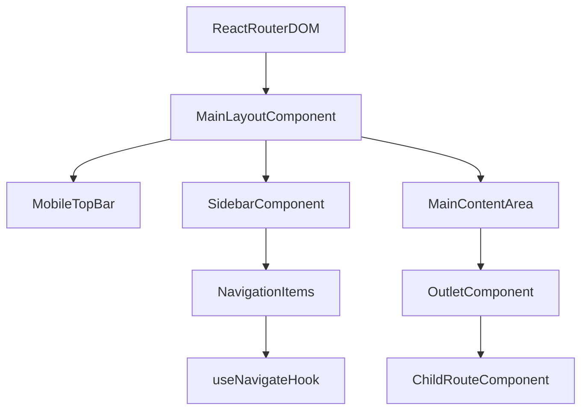

# test-newfile.tsx

> **Source File:** [test-newfile.tsx](https://github.com/test-company-prowiz/Easy-Repo/blob/master/test-newfile.tsx)
> **Repository:** `Easy-Repo`
> **Branch:** `master`

# test-newfile.tsx

### Overview
This file defines the `MainLayout` component, which provides the foundational user interface structure for the application. It includes a persistent sidebar for navigation and a main content area where specific page components are rendered.

### Architecture & Role
The `MainLayout` component resides at the top level of the React UI architecture. It acts as a wrapper for all route-specific content, ensuring a consistent application shell. It belongs to the presentation layer, specifically handling global layout and navigation.

### Key Components
*   **`MainLayout` function component**: The default export, responsible for rendering the overall application structure.
*   **`isOpen` state**: A boolean state managed by `useState` to control the visibility of the sidebar, primarily for mobile responsiveness.
*   **`navItems` array**: An array of objects defining the navigation links, including their display names and corresponding paths.
*   **`Outlet`**: A component from `react-router-dom` that renders the matched child route's element.
*   **`useLocation` hook**: Provides access to the current URL location object, used to highlight the active navigation item.
*   **`useNavigate` hook**: Provides a function to programmatically navigate to different routes.

### Execution Flow / Behavior
1.  The `MainLayout` component renders a full-screen container with a background gradient.
2.  On smaller screens, a mobile top bar with an "AI Documentation Engine" title and a menu toggle button is displayed.
3.  A sidebar is rendered, which is fixed on larger screens and conditionally slides in/out on mobile based on the `isOpen` state.
4.  The sidebar contains the application title and a list of navigation items derived from `navItems`.
5.  When a navigation item is clicked:
    *   The `navigate` function is called to change the URL, triggering a route change.
    *   The `isOpen` state is set to `false` to close the sidebar on mobile.
    *   The `isActive` check, using `location.pathname`, dynamically applies styling to the active navigation link.
6.  The `Outlet` component within the main content area renders the component corresponding to the current route as defined by `react-router-dom` configuration.
7.  Styling, including responsiveness and visual effects (e.g., glow), is applied using Tailwind CSS classes.

### Dependencies
*   **`react`**: Provides the core React library and the `useState` hook for managing component state.
*   **`react-router-dom`**: Provides routing capabilities through `Outlet`, `useLocation`, and `useNavigate` for declarative navigation and rendering of child routes.

### Design Notes
*   The layout prioritizes responsiveness, adapting its sidebar behavior and navigation presentation for different screen sizes.
*   The use of `Outlet` centralizes the application's structural layout, making it easy to apply consistent headers, footers, and sidebars across different pages without repeating layout code.
*   Navigation items are defined programmatically, allowing for easy expansion or modification of the application's primary routes.
*   The design uses a `fixed` sidebar on desktop and a `fixed` but hidden/shown sidebar on mobile, with a `pt-14` on the main content for mobile to account for the top bar.

### Diagram
